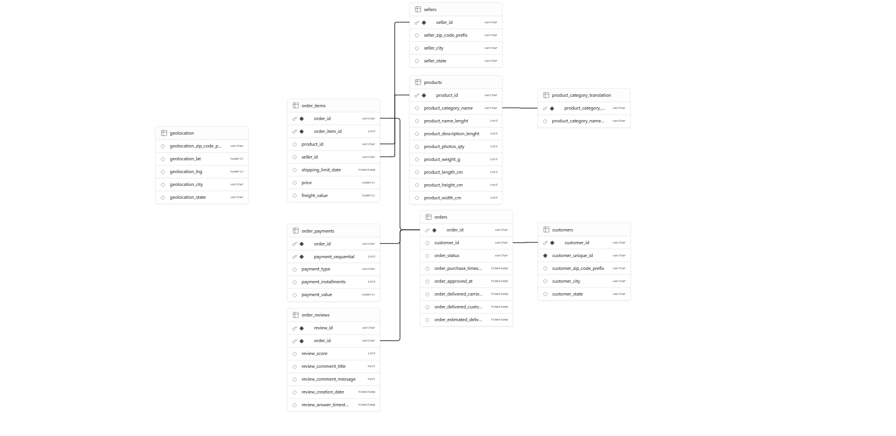
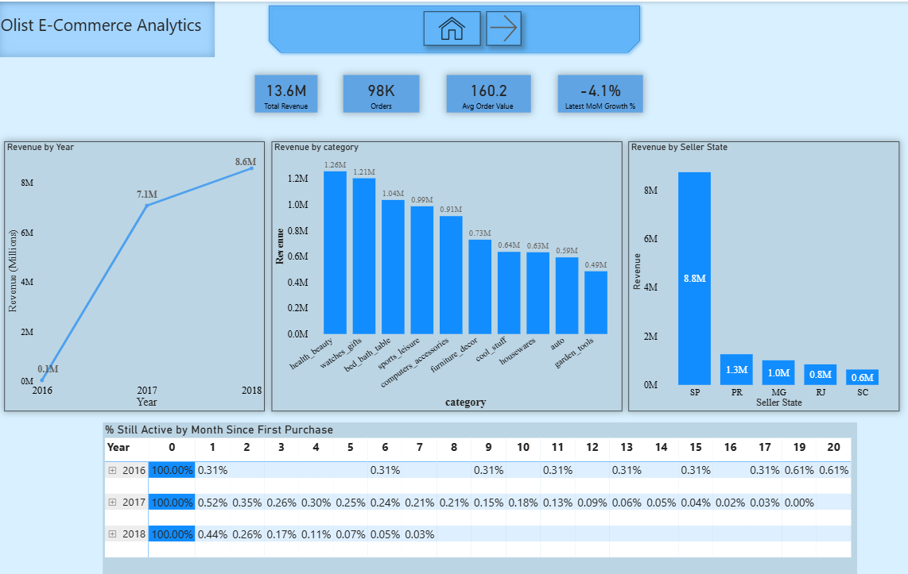
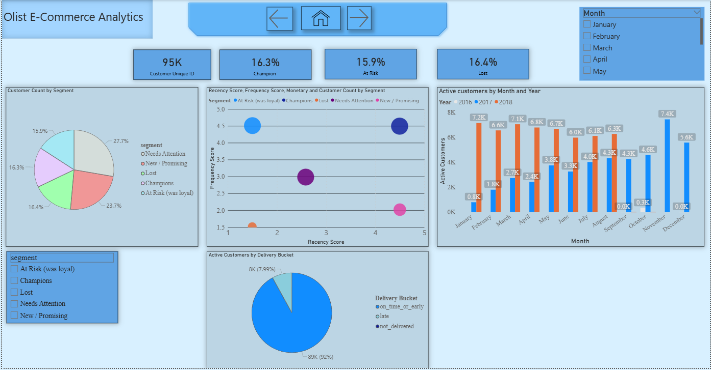
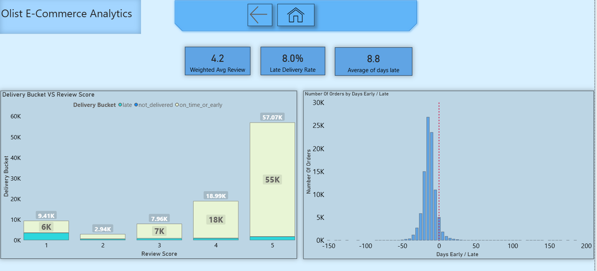

# Olist E-Commerce SQL Analytics

Business-question-driven SQL analysis of ~100K orders from Olist, a Brazilian
e-commerce marketplace, with a Power BI dashboard connected live to a cloud
PostgreSQL database.

## Why this project
I was looking for a large, real-world dataset to demonstrate my ability to
extract meaningful insights from messy data, and to turn those insights into
concrete recommendations a business could act on to improve its processes or
solve real problems. The Olist dataset fit that goal well: a large, multi-table,
genuinely messy relational dataset rather than a single clean CSV.

## Data
- Source: [Olist Brazilian E-Commerce dataset](https://www.kaggle.com/datasets/olistbr/brazilian-ecommerce), Kaggle
- 9 relational tables, ~100K orders, Oct 2016 – Sep 2018
- Hosted on Supabase PostgreSQL (free tier), connected live to Power BI

## Schema


## Dashboard

**Overview**


**Customer Segmentation & Retention**


**Delivery Performance & Customer Satisfaction**


## Business questions & findings

### 1. How is revenue trending month over month?
Revenue grew from a near-zero base in late 2016 to **$13.6M total** across
~98K orders, with an average order value of **$160.20**. consistent across
every individual month, which sit in the $140-$180 range throughout the
dataset's history.

The most recent complete month (August 2018) showed a **-4.1% MoM decline**
versus July 2018. One data-quality note worth flagging here: September 2018
was excluded from all growth calculations. it contained only 1 order,
confirming the raw dataset's collection period ends mid-month rather than on
a clean boundary. Early months (late 2016) were kept in the underlying data
but show extreme % swings due to a near-zero base during the platform's
early ramp-up, so MoM% is most meaningful from 2017 onward.

### 2. How well do we retain customers after their first purchase?
Retention is extremely low, confirming Olist's well-documented pattern of an
overwhelmingly one-time purchase customer base. Across both full cohort years:

| Cohort | Month 0 (first purchase) | Month 1 | Retention |
|---|---|---|---|
| 2017 | 43,708 | 229 | 0.5% |
| 2018 | 52,062 | 231 | 0.4% |

Fewer than 1% of customers in either cohort year make a second purchase within
a month of their first, and the decline continues steadily rather than
plateauing. by month 12, the 2017 cohort is down to 40 active customers out
of its original 43,708. This isn't a data-quality artifact; it held
consistently across two independent full year cohorts, which is strong
evidence it reflects genuine platform behavior rather than a fluke in one
year's data.

### 3. Which customers matter most? (RFM segmentation)
Customers split into five segments based on recency, frequency, and monetary
value:

| Segment | % of customers |
|---|---|
| Needs Attention | 27.7% |
| New / Promising | 23.7% |
| Lost | 16.4% |
| Champions | 16.3% |
| At Risk (was loyal) | 15.9% |

Plotting average recency vs. frequency score per segment confirmed the
segmentation behaves as expected: Champions cluster at high recency + high
frequency, At Risk sits at high frequency but low recency (customers who used
to buy often but have gone quiet), and New/Promising sits at high recency but
low frequency (recent buyers who haven't built up a purchase history yet).

Roughly a third of the customer base (Lost + At Risk, ~32%) represents
customers who were once active but have disengaged, the clearest single
target for a win-back campaign.

### 4. Does late delivery hurt review scores?
Yes, substantially. Average review score by delivery outcome:

| Delivery bucket | Orders | Avg review score |
|---|---|---|
| On-time or early | 88,653 | 4.29 |
| Late | 7,700 | 2.57 |
| Not delivered | 8 | 4.5* |

Late delivery drops average review score by **~1.7 points** — the single
strongest relationship found in this dataset. Late orders make up only ~8% of
volume but are disproportionately damaging to overall customer satisfaction.
(*Not delivered's 4.5 average is based on only 8 orders and isn't
statistically meaningful, noted rather than over-interpreted.)

### 5. Which categories and sellers drive the most revenue?
Top categories by revenue: health_beauty ($1.26M), watches_gifts ($1.21M),
bed_bath_table ($1.04M), sports_leisure ($0.99M), and computers_accessories
($0.91M).

Seller revenue is heavily concentrated geographically: sellers based in São
Paulo state (SP) account for the large majority of total seller revenue
(~$8.8M), far outpacing the next closest state, Paraná (PR, ~$1.3M).

## Recommendations
- **Prioritize delivery reliability over other satisfaction levers**: the
  ~1.7 point review score gap between on-time and late orders is the largest
  single lever found in this data; even a modest reduction in late-delivery
  rate would likely move overall satisfaction more than most other
  interventions.
- **Target the "Lost" and "At Risk" segments (~32% of customers) with a
  win-back campaign** rather than treating all non Champions equally: these
  two segments were previously engaged, making them cheaper to re-activate
  than acquiring new customers.
- **Investigate seller concentration risk** — with SP based sellers
  responsible for the majority of revenue, consider whether this represents
  healthy market leadership or a single-point of failure risk worth
  diversifying against.
- **Treat one-time purchase behavior as the default, not the exception** — with
  second-month retention under 1% across two full cohort years, broad
  loyalty-program investments aimed at "increasing repeat purchases" generally
  are unlikely to pay off; a more targeted approach (e.g. focused on the
  New/Promising RFM segment specifically, where a customer has just shown
  purchase intent) is more likely to move the needle than a platform-wide push.

## SQL techniques used
CTEs · window functions (`LAG`, `RANK`, `NTILE`) · multi-table joins ·
date-truncation cohort logic · views as a clean SQL→BI handoff layer

## Repo structure
```
01_schema.sql              -- table definitions, PK/FK constraints
02_business_questions.sql  -- analytical views answering each question above
dashboard.pbix              -- Power BI file (connects live to Postgres)
screenshots/                 -- dashboard pages
```

## Limitations
- Dataset covers a fixed historical window (Oct 2016 – Sep 2018); "current"
  trends aren't live and shouldn't be read as reflecting present-day
  performance.
- The final month of data (September 2018) was excluded from growth
  calculations due to incomplete collection (only 1 order recorded).
- RFM segment thresholds are a simple quintile (NTILE 5) split on this
  dataset's own distribution, not calibrated against known business targets
  or customer lifetime value benchmarks — segment boundaries would likely
  shift with a different customer base.
- `churn`/retention figures reflect a proxy definition based on purchase
  recency, not a true subscription style churn event.
- 2016 cohorts are excluded from month-level interpretation due to extremely
  small sample sizes (some months had only 1 first time customer), which
  produces statistically meaningless 0%/100% retention swings; the 2017 and
  2018 full year figures reported above are based on tens of thousands of
  customers each and are reliable.
